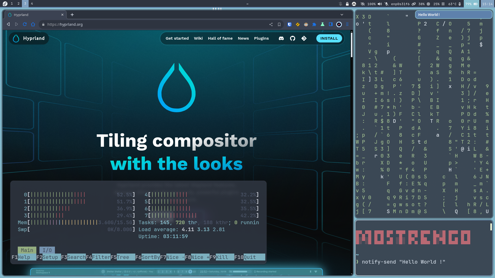

# Hyprland-Dotfiles (Nord theme)
Welcome to the Hyprland-Dotfiles repository! This repository contains my custom configuration files for Hyprland, a beautiful tiling compositor for Wayland. Included are various configuration files for different components and custom scripts to enhance the overall user experience.

## Screenshots
Here is a screenshot of my setup to give you a preview of what to expect:


## Dotfiles
This repository includes the following configuration files:

### Hyprland
- **hypr/hypridle.conf**: Configuration for managing the idle process.
- **hypr/hyprland.conf**: Configuration for managing Hyprland tiling compositor, including the look of applications.
- **hypr/hyprlock.conf**: Configuration for the lock screen.

### Kitty
- **kitty/kitty.conf**: Configuration for Kitty terminal, including colors and behavior.

### Mako
- **mako/config**: Configuration for the appearance of system notifications.

### Rofi
- **rofi/launcher**: Configuration for the application launcher.
- **rofi/powermenu**: Configuration for the power menu.

### Waybar
- **waybar/config**: Configuration for the Waybar status bar appearance.

### Custom Scripts
- **disable-monitor.sh**: Disables the laptop monitor when connected to an external monitor.
- **git-obsidian.sh**: Automates pulling, opening Obsidian, and committing & pushing changes to Git.
- **low-power.sh**: Disables resource-intensive processes, such as making gif wallpapers static.
- **xp-pen**:
  - **cycle-colors.sh**: Cycles colors in the Xournal++ app.
  - **cycle-workspaces.sh**: Cycles Hyprland workspaces using a drawing tablet button.

## Installation
To install these dotfiles, simply run the provided installation script. (As always take a look at the code !)
```bash
chmod +x setup.sh
./setup.sh
```